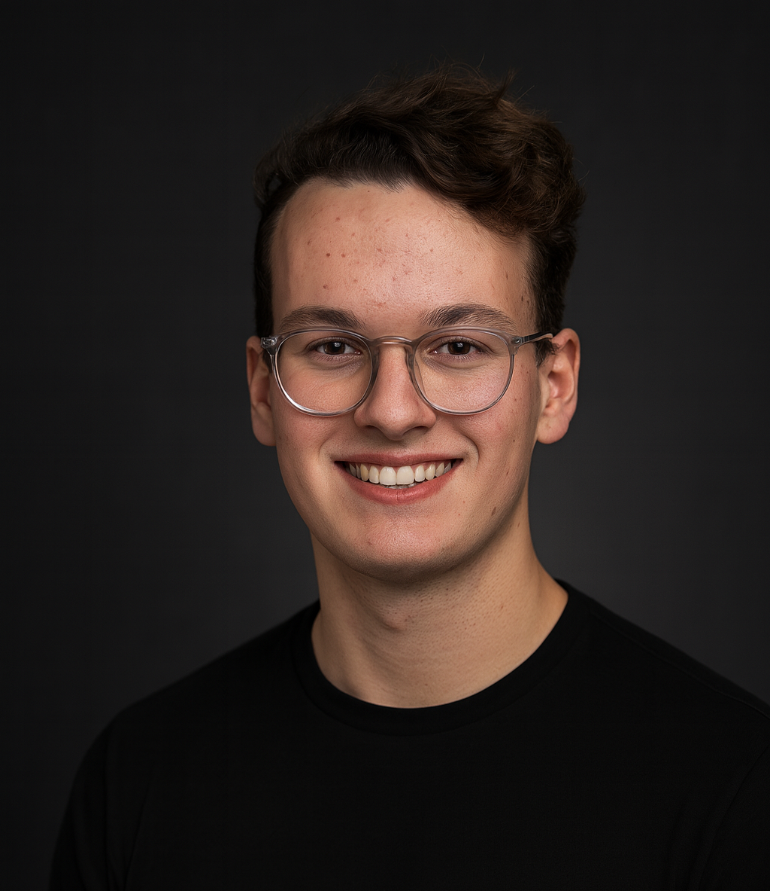

<figure class="principal-portrait">
  
</figure>

## Manuel Asbeck

Manuel Asbeck is the founder and Managing Director of Flits, a home for young companies, experiments, and digital assets.

He is 20 years old and has a background in Information Systems at the Technical University of Munich, where his Bachelor studies are not yet completed.

At Flits, Manuel works on the formation, operation, and long-term stewardship of small digital ventures.
